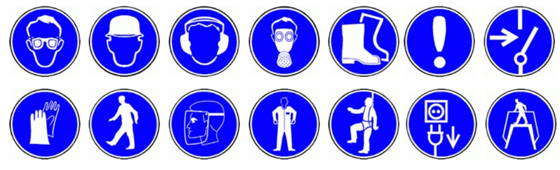

# Seguridad en un taller
Javier Fernández, Jairo Hamburger, Ricardo Merino y Sara Alvarellos

## 1. Tómate tu tiempo

Estos makers que os escriben han de reconocer que alguna vez han sido laxos en la aplicación de los consejos que os van a dar, y la suerte ha querido que por ello solo recibieran algunos cortes y una virutilla en el ojo que al cabo de un par de días requirió de una visita a urgencias. También han visto, en otra ocasión, como una viruta procedente de un corte con radial saltaba y atravesaba la retina de una persona que observaba el proceso. Esa persona se quedó con una invalidez visual de por vida fruto de una simple viruta. Hay muchas razones que nos obligan a NO contar con la suerte como herramienta de trabajo, mejor tener de nuestro lado la previsión, preparación y cautela. A continuación os proponemos seguir estos consejos:

Trabaja siempre cómodo, y no me refiero a bien sentado (de forma ergonómica que es lo ideal, que también). Para trabajar en las cosas hay que tener un sitio acondicionado para la labor a realizar y sobre todo con las herramientas adecuadas para ello. Si hacemos caso a esto al final ganaremos un montón de tiempo.

Iluminación de tu puesto de trabajo. Antes de empezar a trabajar preocúpate de que las condiciones de iluminación sean adecuadas para el trabajo que vas a realizar. Por ejemplo, es importante que mientras manipules objetos y herramientas, las sombras arrojadas por estas no oculten parte de la pieza o herramienta en uso. Para poder llevar a cabo correctamente la acción necesitas ver con claridad, y no te interesa tener puntos muertos de visión.

Comprueba que las personas que están junto al espacio o área de trabajo donde estas realizando la labor sepan qué vas a hacer y qué herramientas vas utilizar. Infórmales de los posibles riesgos que tiene estar cerca tuyo (emanación de gases y polvo, proyección de virutas, riesgos de corte…).

La importancia del calzado dentro de un taller de trabajo. Sabemos que en verano hace mucho calor. Pero NUNCA utilices sandalias y menos pies descalzo dentro de un taller. Por seguridad o por la simple caída de una herramienta podría causar daño de diferente envergadura, desde un simple pinchazo hasta una amputación.

En un taller compartido hay que preocuparse porque todos los proyectos tengan cabida, no sólo el tuyo y que la realización de tu tarea no traiga consecuencias colaterales a otros personas. Esto lo veremos con más detalle en un artículo en concreto más adelante.

Chequea las señales de advertencia y las instrucciones de uso tanto del espacio de trabajo como de los productos/herramientas que vayas a utilizar. Nadie quiere que te pase algo malo y el principio de precaución es el mejor aliado. Si tienes dudas, no lo hagas. Pregunta a otros makers con experiencia en el uso de la máquina que desconoces, documéntate y haz pequeños simulacros antes de operar con la máquina. La primera vez que utilizas una máquina tienes que hacerlo bajo la supervisión de otro maker más experimentado. Recuerda que cada Maker es responsable de su propia actividad.

{ width="100" }
{ width="100" }
{ width="100" }
{ width="100" }
{ width="100" }

## 2. Cuida tu salud y la del medio ambiente

Ten en cuenta que algunos materiales y herramientas que usamos son altamente peligrosos y tóxicos para tu salud y para la del medio ambiente. Ningún fabricante quiere que te lesiones manipulando sus productos así que éstos están llenos de consejos de uso para eximirse de responsabilidades. Infórmate sobre cómo tienes que manipular y procesar los residuos resultantes de tu actividad.

Lávate siempre las manos antes de frotarte los ojos, tocarte la cara, etc. Parece obvio, ¡pero muchas veces lo hacemos sin darnos cuenta!

No tires productos tóxicos por el retrete del baño o a la basura genérica. Existen puntos limpios de recogida de esta clase de residuos dónde especialistas tienen medios para canalizar los residuos tóxicos o peligrosos para el medio ambiente. Recuerda que la red de aguas y los vertederos son un bien común, y todo producto nocivo no bien procesado puede envenenar acuíferos e introducirse en la cadena alimenticia a través de los alimentos.

## 3. Trabaja bien, trabaja seguro

### 3.1. Si vas a trabajar con herramientas afiladas (como un cúter ) recuerda:

Como siempre, primero revisa el estado de la mesa en la que vas a trabajar, no debe haber nada que obstaculice el movimiento de tu brazo.

No uses la herramienta en dirección al cuerpo; la dirección de la fuerza que utilices debe ser hacia fuera, evitando dar tirones o sacudidas.

Una vez termines tu tarea, recuerda guardar completamente la cuchilla en el mando, en el caso del cúter, o en el caso de otra herramienta afilada proteger el filo.

### 3.2. Si usas herramientas que friccionan sobre objetos/piezas (fresadora, radial…)

Con la máquina siempre desconectada, comprobar que los elementos/herramientas de corte de la máquina están bien fijados. Verificar el sistema de fijación de los mismos evitará que el disco de la radial o la broca del taladro salgan despedidos y provoquen accidentes.

Fija las piezas sobre las que vas a operar, es muy difícil (y peligroso) hacer malabarismos sujetando cosas mientras intentas taladrar, fresar, cortar.. . Unas buenas mordazas o sargentos mantendrán las piezas sujetas mientras las trabajamos. Haz varias pruebas antes de taladrar, estas herramientas tienen un torque muy elevado y son capaces de mover piezas que están fijadas de manera precaria.

Las vibraciones pueden hacer que las roscas de fijación de mordazas y sargentos se aflojen. Revisa cada ciertos ciclos que las fijaciones no han cedido.

Si hay herramientas cortantes o mecanismos en marcha usa los guantes, siempre es mejor que el mecanismo se quede atascado con el guante y no con tus dedos.

Usa siempre las gafas de protección cuando trabajes con estas herramientas, ya que es muy probable que salten virutas y/o partes de la pieza sobre la que se está trabajando. ¡Protege tus ojos!.

Nunca utilices el interruptor de una regleta para apagar las herramientas sin desconectar el botón de encendido. La siguiente persona que llegue podría apoyarse en la herramienta para encender la regleta y verse atrapado por la máquina cuando esta arranque sola. Piensa siempre en la persona que va a utilizar después la máquina y deja todo en la posición de apagado.

### 3.3. Si vas a trabajar con madera

Utiliza guantes, gafas protectoras y usa mascarilla para proteger tus pulmones.

Son muchas las operaciones que generan polvo de madera: aserrado, lijado, agujereado, etc. Las partículas de polvo más finas quedan suspendidas en el aire y pueden ser inhaladas por las personas que se encuentran en el espacio. La exposición prolongada al polvo de madera se relaciona con una gran variedad de efectos para el sistema respiratorio: asma, bronquitis crónica, e incluso cáncer de senos nasales. Por este motivo cuando se trabaja con madera de forma prolongada, debe respetarse lo dispuesto en el Real Decreto 665/1997 (1) sobre la protección de los trabajadores. Para completar esta información que brevemente introducimos puedes consultar los folletos informativos del Instituto Nacional de Seguridad e Higiene en el trabajo (2).

### 3.4. Si vas a usar herramientas con cable.

Asegúrate de tener siempre suficiente cable para realizar todos los movimientos y maniobras que necesitas. Nunca trabajes dando tirones al cable, cuando no tengas margen de maniobra, cámbiate de posición o busca un lugar más adecuado para realizar la tarea. Estos son algunos escenarios que ilustran esta situación a la que nos referimos:

Todo el mundo odia estar arreglando algo y que por culpa de un tirón del cable se estropee el trabajo que lleva horas realizando. En el mejor de los casos, si estás utilizando por ejemplo un taladro, sólo tienes que parar tu actividad para volver enchufar la herramienta. Sin embargo, esto es una verdadera lata si te encuentras trabajando en altura, sobre una escalera por ejemplo. Por eso, y por tu seguridad, es fundamental planificar bien la tarea que vamos a realizar y estudiar las necesidades que vamos a tener.

Soldando componentes electrónicos con el cable del soldador tenso, es imposible hacer buenas soldaduras . Además un tirón del cable del soldador puede hacer que se te escurra dentro de la mano y que acabes tocando la parte del soldador a 230º provocándote una quemadura importante.

No tiendas trampas mortales para osos en los espacios comunes, es decir, no atravieses con cables zonas de paso. Por lo general las personas que frecuentan el espacio estarán pensando en sus proyectos y no se imaginarán que tienen que saltar a la comba en el taller. Si no hay otro remedio que cruzar con un cable una zona de paso, informa a las personas que comparten el espacio contigo, señaliza la zona, asegura con cinta americana que el cable no sobresalga , protege la camisa del mismo de posibles abrasiones, pinzamientos, caída de objetos, etc.

Recuerda siempre que el taladro y la radial giran a una velocidad de 6000 rpm. Esto significa que si no sujetas firmemente la herramienta durante el arranque de la misma, puedes llegar a lesionarte la muñeca. Es muy importante conocer bien cómo debe ser la sujeción de la herramienta, y que una persona experimentada te enseñe a utilizarla.

## 4. Consulta la normativa

Estos consejos de seguridad son meramente informativos y basados en nuestras experiencias. Te recomendamos que para obtener una información más detallada y concreta para la actividad que tengas que desarrollar consultes las normativas vigentes. Nosotros hemos consultado las siguientes:

Real Decreto 486/1997, de 14 de abril, sobre lugares de trabajo.

Real Decreto 286/2006, de 10 de marzo, sobre ruido.

Real Decreto 485/1997, de 14 de abril, sobre señalización.

Por último hemos recogido las señales más habituales que te puedes encontrar en un taller, si tienes cualquier duda puedes consultar la normativa:

-Señales de obligación:

-Señales de advertencia de peligro:

(1) Puede consultarse aquí: http://www.boe.es/buscar/doc.php?id=BOE-A-1997-11145

(2) Ver folleto aquí: http://www.insht.es/InshtWeb/Contenidos/Documentacion/CATALOGO%20DE%20PUBLICACIONES%20ONLINE/FOLLETOS/NOVEDADES%202011/polvo_madera.pdf

