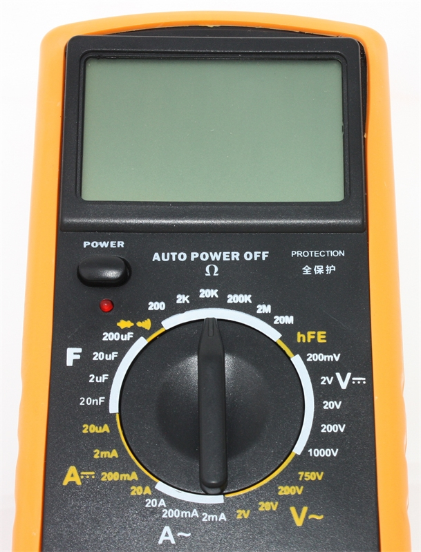
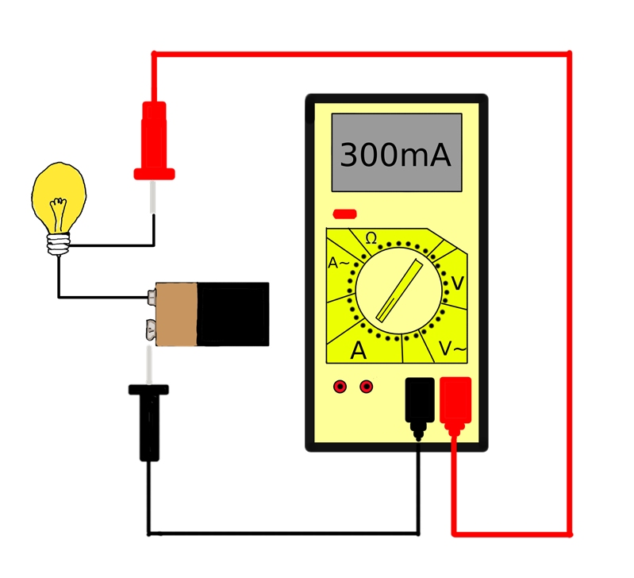
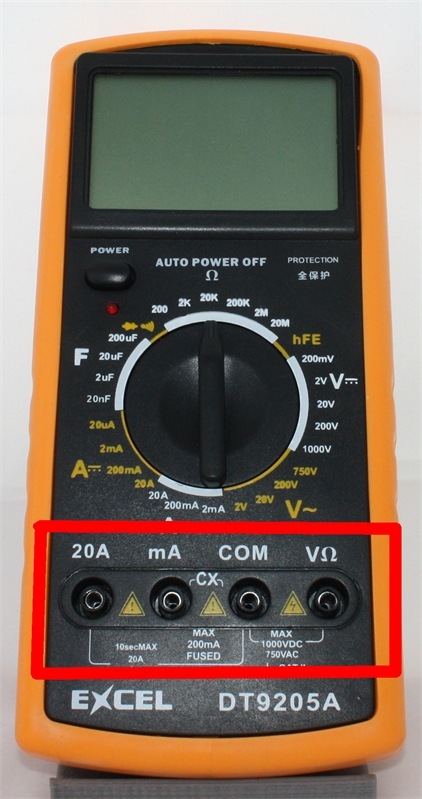
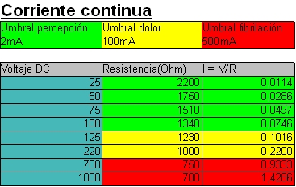
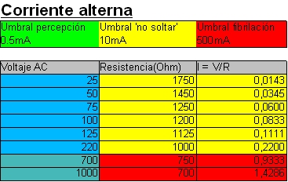

# Midiendo cosas
## 1. El Multímetro:

El multímetro (también llamado polímetro o tester) es una herramienta de medida de magnitudes eléctricas con el que podremos comprobar, a grandes rasgos, que está pasando dentro de un cable o circuito.

En general todos los multímetros, incluidos los más baratos, pueden medir corriente (A - amperios), potencial (V - voltios) y resistencia (Ω - ohmios) de forma bastante fiable. Los multímetros más avanzados también pueden medir condensadores, transistores y temperatura.

Dependiendo de lo que vayamos a medir tenemos que conectar el multímetro en serie o en paralelo con el circuito que vayamos a medir, y conectar las sondas de forma adecuada, como en los siguientes ejemplos:

### 1.1 Midiendo resistencias

Podemos medir la resistencia de un componente de una forma muy simple:

1. Encender el multímetro.
2. Seleccionar el modo para resistencias, generalmente viene indicado con la letra griega omega (Ω) ya que la lectura se dará en ohmios.
3. Ajusta la escala, dependiendo de la resistencia que estimes encontrar.
4. Coloca una punta del multímetro en cada extremo del elemento del que quieras conocer su resistencia.

Nota: Este modo es muy útil para descubrir cortocircuitos, ya que cualquier elemento que se encuentre "en corto" tendrá una resistencia de 0.

### 1.2 Midiendo Voltajes

Para medir un voltaje debemos seguir los siguientes pasos:

1. Encender el multímetro.
2. Selecciona el modo voltímetro. El modo de corriente alterna generalmente aparece como Ṿ~, mientras que el de corriente continua es únicamente V.
3. Ajusta la escala, dentro del modo tienes varias escalas para ajustar la lectura a la medición que esperas.
4. Coloca las puntas del multímetro en el circuito que quieras medir, de tal manera que el multímetro esté montado en paralelo con el elemento que queramos medir.

### 1.3 Midiendo intensidades

Podemos conocer la intensidad que atraviesa un circuito de la siguiente forma:

1. Una vez encendido el multímetro selecciona el modo amperímetro (Generalmente representado con una A).
2. Ajusta la escala, dependiendo del multímetro que utilices esta puede ir desde µ algunos hasta varios amperios.
3. Coloca las puntas del multímetro de tal forma que este pase a ser un elemento en serie con el circuito que quieres medir.

### 1.4 Precauciones:

- Comprueba siempre que las sondas están conectadas correctamente para la medida que vamos a hacer.
- Evita tocar las puntas de las sondas mientras estás midiendo, para evitar alterar la medida, y la posibilidad de recibir una descarga inesperada.
Las sondas deben estar colocadas en el conector correspondiente dependiendo de si queremos medir intensidad, voltaje o resistencia, de lo contrario dañaremos el multímetro.
- Cuando un multímetro deja de funcionar generalmente se debe a que el fusible de protección se ha roto. Es posible reparar esta avería simplemente abriendo el multímetro y sustituyendo el fusible que lleva por uno de similares características.

**¿Te mata la intensidad o el voltaje?**

La combinación de ambos en realidad, unos pocos miliamperios en el corazón son suficientes para alterarlo, aunque el voltaje es clave para superar la barrera de resistencia de la piel.

En la norma UNE 20572 se establecen una serie de umbrales y efectos fisiológicos, estos varían mucho entre corriente continua y alterna.

- **El umbral de percepción** es cuando la corriente es suficiente para notarla, sintiéndose como un cosquilleo.
- **El umbral de no soltar** es cuando la intensidad es suficiente para contraer los músculos impidiéndote soltar un cable, esto sucede solo en corriente alterna. En continua se considera el umbral del dolor, pues causaría calor y una sensación dolorosa.
- **El umbral de fibrilación** es cuando la corriente es suficiente para interferir al corazón.
Como se ve en las tablas, la corriente continua es mucho más segura que la alterna, y por debajo de 50V apenas llega al umbral de percepción, es por esto que los sistemas de control la utilizan en las partes donde el usuario interactúa, para minimizar los riesgos.

