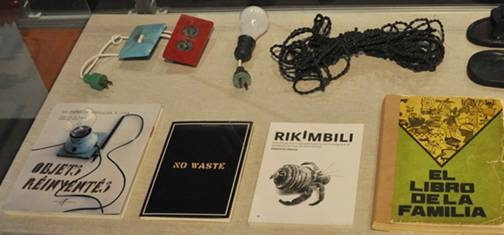

# Historia, antepasados y visiones del Movimiento Maker

Palabras Clave: Maker, DIY, KIT, Arts&Craft, RepRap, Arduino, Linux, Open Software-Hardware, Consumismo, Reciclaje,

## 1\. “Hola Mundo” Nacimiento o bautizo del movimiento Maker

Oficialmente, el origen del llamado “Movimiento Maker” nace aproximadamente en 2005 coincidiendo con el lanzamiento de la revista Make Magazine (California), y en la que se publicaban proyectos DIY (Do It Yourself - Hazlo tu mismo) con ordenadores, electrónica, robótica y carpintería de metal y madera entre otros. En 2006 la revista organiza la primera Maker Faire (Feria Maker) con más de 100 expositores en el San Mateo County Event Center. Este nacimiento y crecimiento tan espectacular, para mi, sólo tiene sentido si consideramos que esto viene de antes, pero se le pone nombre en California.

## 2\. Los tatarabuelos del movimiento: “La techné” y el homo habilis.

Ya Aristóteles describe la _techné_ (arte) como la acción, a partir de la cual el hombre produce una realidad nueva. Los griegos emplearon el término _techné_ incluyendo no sólo las “bellas artes” (pintura, escultura…) sino todo tipo de producción humana en la que se crea una realidad que antes no existía. El carpintero, el escultor, el arquitecto, el orfebre… todos ellos son artistas por que producen algo inexistente utilizando su técnica.

Pero podríamos ir más atrás para encontrar antecedentes, quizá hasta el origen mismo del ser humano, desde que la evolución de las especies nos distingue del resto de animales, podríamos decir que los primeros humanos ya eran Makers 100%, se fabricaban todo ellos mismos con los medios que tenían y compartían sus técnicas, al menos con su tribu. Se dice que el homo habilis ya podía fabricar **utensilios de piedra** ¡hace 1.4 millones de años!.

En esta época, las técnicas eran muy rudimentarias pero aún hoy en día resulta difícil reproducir algo tan básico como hacer fuego con unas maderas secas o unas hachas como las de la fotografía.

Fig.1

[http://es.wikipedia.org/wiki/Industria\_l%C3%ADtica#mediaviewer/File:HMB\_Steinaxtmanufaktur_%282\_von\_3%29\_Vinelz\_Jungsteinzeit\_2700\_BC.jpg](http://es.wikipedia.org/wiki/Industria_l%C3%ADtica#mediaviewer/File:HMB_Steinaxtmanufaktur_%282_von_3%29_Vinelz_Jungsteinzeit_2700_BC.jpg)

## 3\. Los padres… Arts & Crafts

A mediados del siglo XIX, surge en Inglaterra y se desarrolla en Estados Unidos una escuela artística que formó el denominado movimiento _Arts and Crafts_ (_"Artes y Oficios"_) y que se caracterizaba por evitar los métodos industriales y explotar al máximo las manualidades rescatadas de la edad media. William Morris, artesano, impresor, diseñador, escritor, poeta, activista político, acuñó a comienzos del siglo XX este término, y junto con muchos otros impulsores como Charles Robert Ashbee, T.J. Cobden Sanderson, y los artistas del movimiento prerrafaelista, recuperaron oficios que la revolución industrial había marginado. La filosofía del movimiento era anteponer la creatividad, la integridad de los materiales y las personas, a la imperante producción en masa.

Aquí podemos observar un paso atrás, aprovechando la técnica anterior y otro hacia delante, priorizando la personalización y la creatividad individual como en el movimiento Maker.

Fig.2

## 4\. Los padrinos…(RepRap, Arduino, Open HW-SW)

Paralelamente han surgido varios movimientos que podríamos llamar "los padrinos desinteresados", puesto que han propiciado y facilitado en gran medida el desarrollo del movimiento maker.

**RepRap** es la primera iniciativa de máquina de fabricación de bajo coste que imprime copias de sí misma, y con ello permite la clonación y la evolución que cada agente quiera darle, puesto que no existen restricciones legales. Su gran crecimiento ha sido posible gracias a que su inventor, Adrian Bowler, lo compartió con Licencia Pública General de GNU. Con esta fábrica de escritorio, los “Makers” pueden hacer casi cualquier pieza de plástico que se imaginen o copien, a costes reducidos (< 0.02€ / cm³).

**Arduino** es el segundo gran padrino, es una placa electrónica con microcontrolador, que se utiliza casi todas las impresoras RepRap, y entorno de desarrollo libre. Esta tarjeta sirve para controlar mediante entradas y salidas electrónicas multitud de sensores, motores y actuadores, permitiendo así hacer rápidamente prototipos y dispositivos muy económicos ( < 30€ ). La gran comunidad de usuarios de Arduino, comparten miles de programas y circuitos con los que se facilita el aprendizaje y desarrollo de nuevas aplicaciones particulares o empresariales.

**Linux y el Software Libre**, son los otros padrinos que no debemos dejar de mencionar. Linux es un sistema operativo con licencia GNU, y en él, se ha desarrollado mucho software libre de modelado 3D, imprescindible para crear las piezas que queramos imprimir en RepRap. Existen sistemas operativos y software propietarios dónde podemos hacer lo mismo y mejor en algunos casos, pero dónde el límite lo impone la estrategia comercial y el ritmo de evolución del propietario, y no la comunidad o la necesidad del usuario como ocurre con el código abierto.

Seguramente ha habido otros muchos participantes en la "crianza" de este movimiento, como el transistor, y todos los componentes de electrónica y mecánica de bajo coste, pero hemos querido citar a los más visibles.

## 5\. Consumismo y caducidad vs Reciclado y Maker

Vivimos en una sociedad donde todos somos, en mayor o menor medida, consumidores de un mercado global que nos ofrece millones de productos y servicios por un precio que va desde ser gratis hasta lo astronómico, y con los impuestos y aranceles correspondientes (en 2014 por el 21% de IVA General, ¿en 2020? ¡A saber!). En toda esta maraña de transacciones económicas, uno nunca sabe toda la verdad, ya que se da la famosa asimetría de información.

Cuando uno compra un producto, sólo hay una cosa segura, que desde ese momento el "valor" se desploma. El sistema, no sabemos cómo, hace que parezca que todo tiene caducidad, y que no se puede arreglar, pues NO. Un Maker seguramente intentará **arreglarlo** para darle otra vida, o despiezarlo y aprovechar las partes útiles. El resto de piezas se irán al contenedor correspondiente para que una empresa recicle y revalorice las materias "basura".

El ciclo de vida habitual de un producto:

Producción → USO → Basura/%Reciclado

La vida del producto es bastante predecible, y muy rentable para las empresas y estados, porque en cada paso hay una transacción económica.

Por el contrario el proceso **extendido**, si podemos llamarlo así:

Producción → USO → Producto-n-Arreglos → USO → Desguace-m-piezas

→ 1-Subproductos Nuevo → Uso → Basura/%Reciclado

→ 2-Subproductos Nuevo → Uso → Basura/%Reciclado

…

→ m-Subproductos Nuevos → Uso → Basura/%Reciclado

La vida del producto se alarga con cada arreglo, con la consiguiente reducción de residuos por unidad de tiempo y ciclo económico, y con un impacto económico similar pero dilatado en el tiempo.

Otro factor a destacar, es que en cada auto-reparación reducimos: las importaciones, los transportes, la contaminación y el gasto innecesario de recursos naturales finitos.

Existen ejemplos como Cuba, dónde el bloqueo ha hecho que se desarrolle mucho una cultura “Reciclator”, y que yo incluiría dentro del ADN de los Maker. Ernesto Orozco ilustra muy bien en su obra “Desobediencia Tecnológica” (expuesta en el Miami Science Museum 2014) el gran ingenio Maker con escasos recursos.

Fig.3

## 6\. Crear y compartir conocimiento

El hombre siempre ha compartido con su comunidad sus técnicas de caza, cultivo, supervivencia, etcétera. Las formas de comunicar este conocimiento han evolucionado desde la imitación, la tradición oral, la escritura, los libros hasta culminar en el siglo XVII con la creación de la primera **Enciclopedia** en Francia.

Luego llegará a la era digital con internet, los emails, la Wikipedia, y más específicamente, con wikis y páginas web como intructables.com y videos, dónde se explica abiertamente **cómo hacer** cosas. Los Makers participan activamente en esta actividad tan altruista, y ayudan al desarrollo de áreas de conocimiento libre e independiente del yugo económico imperante.

## 7\. Lo público, lo privado, y lo secreto.

A lo largo de la historia, siempre ha habido una lucha entre distintos grupos y estados por el poder que tiene el conocimiento en ciertas áreas. El primer grupo, casi siempre ha sido militar, ya desde nuestros antepasados, quien controlaba el hierro superaba al que sólo manejaba piedras, hasta llegar a los que manejan drones tienen menos bajas que los que utilizan tanques, etcétera.

Otro ejemplo muy curioso eran los mapas o cartas de navegación, los estados que tenían las mejores rutas, adelantaban a los que no, nuevas tierras colonizadas y más rutas comerciales.

Este tipo de descubrimientos, nacen en secreto, se explotan en privado por ciertas empresas y se liberan cuando no es posible ocultarlo, o no crea ventaja. El movimiento Maker explora muchos campos, pero creo que no busca crear armas de destrucción masiva, ni cosas por el estilo, aunque algunos medios saquen de vez en cuando la famosa pistola de plástico, tan letal como el cuchillo de cualquier cocina.

Con los conocimientos “privados”, como la propiedad intelectual, las marcas, las patentes y las licencias entre otras, se ha creado una maraña muy interesante que nutre a registradores y abogados de la actividad de proteger los derechos adquiridos.

## 8\. Los emprendedores y el long tail.

Otro de los rasgos de identidad de los miembros del movimiento Maker es su creatividad y el deseo de que sus creaciones se propaguen por todo el mundo, con mayor o menor beneficio monetario. Por eso es frecuente encontrar makers/emprendedores desarrollando prototipos de sus productos o creando su startup para entrar en los nuevos mercados que internet ha propiciado.

Los mercados "tradicionales" buscan productos muy populares dónde un pequeño catálogo se venda a millones de consumidores, siguiendo una distribución de Pareto o Lévy, dónde aproximadamente, el 20% de los productos se llevan el 80% del mercado (zona verde Fig.4). Los nuevos mercados influenciados por internet y la reducción de costes de almacenamiento, permiten tener catálogos inmensos (p.e. Amazon) con ventas mucho más reducidas por cada artículo, y por eso la curva se ha aplanado en ciertos mercados. Estos dos factores hacen un camino más fácil a los "pequeños" emprendedores, que pueden producir y distribuir sus productos con costes más reducidos y que en el caso de ser digitales, son casi nulos (p.e. venta de software online, libros en PDF o eBooks).

Fig.4

## 9\. Futuros posibles del Movimiento Maker

No podemos conocer el futuro, pero si me gustaría hacer unas reflexiones basadas en las tendencias que se observan en la siguiente gráfica, con los términos más buscados en España relacionados con el mundo maker.

Desde el 2011, crecen las búsquedas de “KIT”, “DIY”, “Arduino” y más tímidamente “Impresora 3D”, y decrecen las de “Maker”. Si consideramos las búsquedas en google, como un indicador del nivel de interés, creo que cada día hay más personas quieren hacer sus propios circuitos con Arduino, montar KITs o fabricarse lo que sea siguiendo las instrucciones de cualquier manual DIY o bricolaje.

Los motivos para querer hacerse uno mismo, pueden ser muchos, pero creo que los principales son el ahorro y la satisfacción de crear y personalizar con nuestras manos aquello que necesitamos.

Fig. 5 (Gráfica obtenida en http://www.google.com/trends/)

Un caso que quiero relacionar son los kits de IKEA. Esta compañía ha conseguido convertir a todos sus clientes en “monta-makers”. Para ello ha simplificado al máximo la fase de montaje de miles de muebles y accesorios, publicando las instrucciones. Otros ejemplos son las Wikis, dónde cualquier persona puede crear una página web sencilla totalmente operativa, o los PC clónicos por componentes, o las impresoras RepRap fabricadas en casa por otras impresoras semejantes. Estos casos indican, que cada vez más, un individuo normal puede hacer cosas que no hace mucho tiempo estaban limitadas exclusivamente al ámbito profesional/empresarial por precio y conocimiento. Este avance de las posibilidades personales creo que es imparable y choca en algunos casos con los intereses del consumismo puro, que entiendo que prefiere vender productos finales de máximo valor añadido, y con fecha de caducidad establecida.

El futuro podría ser como lo retrató George Lucas en STAR WARS, con colonias autosuficientes por energía solar, robots reciclados y auto-reciclados que ayudan a los humanos. Pero me surge una pregunta, en ese escenario ¿quienes son los makers, los robots o los humanos? Quizás ambos, pero me encantaría verlo y experimentarlo.

## 10\. Referencias

[http://stgomakerspace.wordpress.com/2013/01/30/2732/](http://stgomakerspace.wordpress.com/2013/01/30/2732/)

[http://en.wikipedia.org/wiki/Make_%28magazine%29](http://en.wikipedia.org/wiki/Make_%28magazine%29)

[http://lucilius.aprenderapensar.net/2010/01/28/la-techne/](http://lucilius.aprenderapensar.net/2010/01/28/la-techne/)

[http://es.wikipedia.org/wiki/Homo_%28g%C3%A9nero%29](http://es.wikipedia.org/wiki/Homo_%28g%C3%A9nero%29)

[http://es.wikipedia.org/wiki/Industria\_l%C3%ADtica#mediaviewer/File:HMB\_Steinaxtmanufaktur_%282\_von\_3%29\_Vinelz\_Jungsteinzeit\_2700\_BC.jpg](http://es.wikipedia.org/wiki/Industria_l%C3%ADtica#mediaviewer/File:HMB_Steinaxtmanufaktur_%282_von_3%29_Vinelz_Jungsteinzeit_2700_BC.jpg)

[http://www.ernestooroza.com/tag/desobediencia-tecnologica/](http://www.ernestooroza.com/tag/desobediencia-tecnologica/)

[http://commons.wikimedia.org/wiki/File:Longtail.jpg](http://commons.wikimedia.org/wiki/File:Longtail.jpg)